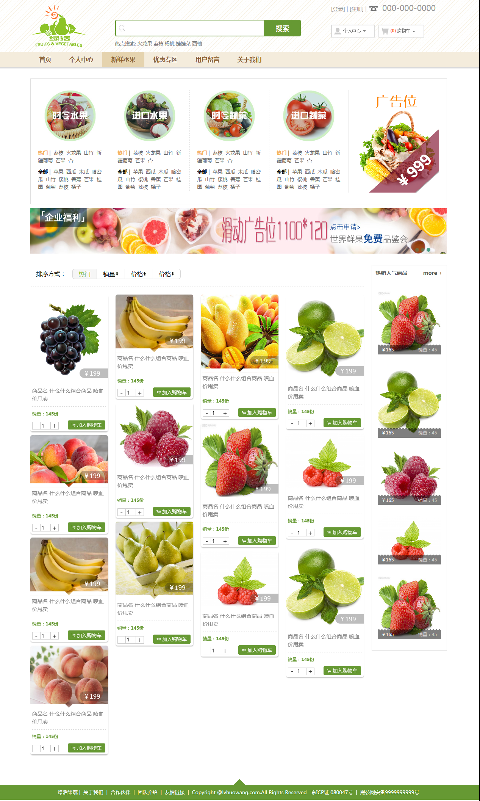

##★ 绿活网新鲜水果购物网站##
> 绿活网是一个新鲜水果购物网站，公司采用O2O的电子商务模式，网站拥有B2C购物网站的大部分功能。
> 采用Struts2+Spring+Hibernate开源框架和MySQL数据库。
> 本人负责整个网站的视觉设计，网站前台页面前端开发，配合后台实现ajax交互。
* 整个网站基于jQuery框架开发
* 用到大量的前端特效和ajax交互和json解析渲染页面；
* 产品列表使用了瀑布流展示；
* 个人中心用到了基于hash单页应用和前端分页；
* 而且，首次用到inco font和sea.js并深刻体会到它们优点。

